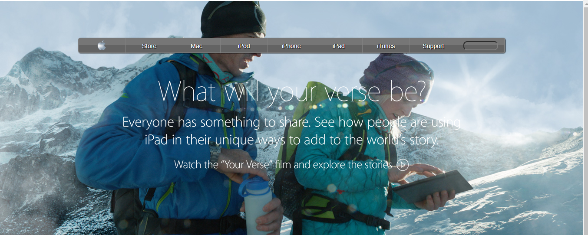
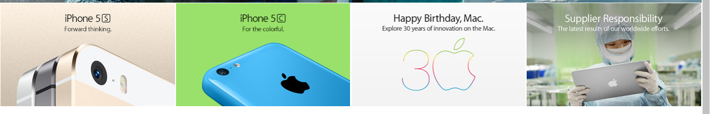

# Building_backgrounds

This is the fourth project of the Main HTML/CSS curriculum at [Microverse](https://www.microverse.org/) - @microverseinc
* The goal was to recreate an old version of Apple's main page 
* The project was completed using html and css 

#### [Assignment link](https://www.theodinproject.com/courses/html5-and-css3/lessons/building-with-backgrounds-and-gradients)

#### [Live Version](https://raw.githack.com/flov3rh/Building_backgrounds/master/index.html)

#### Screenshots

#### Author

* [@Flover](https://github.com/flov3rh)
